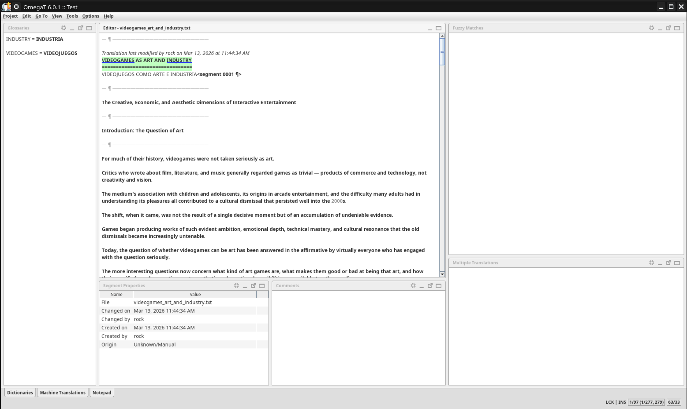
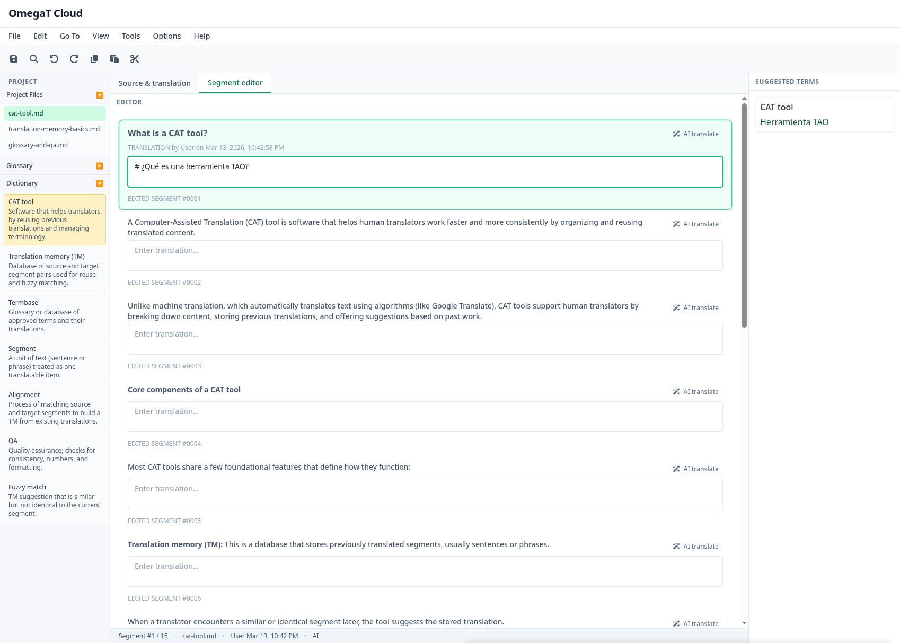

# OmegaCloud — Cloud Translation Memory Assistant

> **This is a prototype.** It is not a final product. The UI, data, and behavior are for demonstration and experimentation only. Do not rely on it for production translation work. Features may change or be removed without notice.

OmegaCloud is a browser-based prototype that mimics a translation memory (TM) and CAT-tool workflow: load demo documents, extract segments, match against a TM, and use glossary suggestions and optional AI translation. All demo content is mock data.

## Documentation

- **[Modernized features](docs/modernized-features.md)** — Features brought from the OmegaT (Java) version (TM, segments, glossary, editor, etc.).
- **[New features](docs/new-features.md)** — New capabilities such as AI translation, cloud architecture, and REST API.
- **[Roadmap](docs/roadmap.md)** — How the modernization can escalate with a multidisciplinary team (MVP → collaboration → scale).

---

### Screenshots

**OmegaT (desktop)**



**OmegaCloud (web)**



---

## Architecture

```
┌─────────────┐         ┌─────────────────┐       ┌──────────────────┐
│  React SPA  │──REST──▶  FastAPI        │──DB───▶  MongoDB or SQL  │
│  :5173      │         │  :8000          │       │  (configurable)  │
│  (prototype │         │  rapidfuzz      │       └──────────────────┘
│   UI)       │         │  matcher        │
└─────────────┘         └─────────────────┘
```

## OmegaT Business Rules Preserved

The following core OmegaT behaviors are faithfully reimplemented:

- **Exact match**: normalized string equality → `confidence: 100`, `matchType: "exact"`
- **Fuzzy match**: Levenshtein similarity via rapidfuzz ≥ configurable threshold (default 75%) → `matchType: "fuzzy"`
- **No match**: score below threshold → `matchType: "none"` (AI translation available separately)
- **Normalization**: whitespace stripping and collapsing before comparison, preserving punctuation
- **Glossary independence**: term detection runs regardless of TM match result
- **TM/AI separation**: TM matching never falls back silently to AI — user intent is explicit

---

## Quick Start

```bash
# 1. Clone the repository
git clone git@github.com:to-var/omega-cloud.git && cd OmegaCloud

# 2. Copy environment files
cp backend/.env.example backend/.env
cp frontend/.env.example frontend/.env

# 3. Start all services
docker compose up --build
```

The frontend will be available at `http://localhost:5173` and the API at `http://localhost:8000`.

---

## Demo documents (mock data)

Source text comes from **markdown files** in `frontend/src/data/demo-documents/`. They are **embedded at build time** (imported as raw text), so the app never fetches them from the server and always shows the correct content.

- **early-arcade-and-consoles.md** — Birth of video games: arcade and home consoles (Pong, Atari 2600, 1983 crash).
- **rise-of-3d-and-cdrom.md** — The 1990s shift to 3D graphics and CD-ROM (PlayStation, N64, FPS).
- **indie-and-digital-distribution.md** — Indie games and digital storefronts (Steam, itch.io, crowdfunding).

Use the **document dropdown** in the header to switch between these demo documents. To add more demos, add a new `.md` file under `src/data/demo-documents/`, import it in `frontend/src/data/demo.ts` with `?raw`, and add an entry to `DEMO_DOCUMENTS`.

---

## Prototype flow

1. **Select target language** — Choose the translation target (e.g. Spanish, French) in the header. Glossary, dictionary, and TMs are filtered by this language; AI translation uses it too.
2. **Select a demo document** — Choose one of the mock markdown documents from the dropdown. Its content is loaded and split into segments automatically.
3. **Select a Translation Memory** — Choose a TM from the sidebar (data in the database; add via API or scripts).
4. **Run matching** — Click **Run Matching** to match segments against the selected TM. Match quality is shown with badges (exact / fuzzy / no match).
5. **Segment editor** — Work in the segment editor or switch to the **Source & translation** diff view. Click a segment or focus its translation field to see **suggested terms** (glossary matches for that segment) in the right panel.
6. **AI translation** — Click the wand icon on a segment, or “Translate whole document,” to request an AI-powered translation. AI translation is provider-agnostic: OpenAI and Anthropic are supported out of the box; additional providers can be added by implementing the `AITranslationProvider` protocol.

---

## Configuration (prototype)

- **Backend `.env`** — **`DATABASE_BACKEND`** (`mongodb` or `sql`) and, for SQL, **`DATABASE_URL`** (e.g. SQLite or PostgreSQL). MongoDB: `MONGODB_URI`, `MONGODB_DB_NAME`. TM threshold: `TM_FUZZY_THRESHOLD`. AI translation: `AI_PROVIDER` and the matching API key. Optional `SEEDS_DIR` for seed JSON path.
- **Frontend** — Demo document list and markdown files are in `frontend/src/data/demo-documents/` (embedded at build time). Glossary and dictionary are loaded from the API (stored in the database). **Target language** is selected in the header; the list and display names come from **GET /languages** (see below).
- **Supported languages** — Defined once in **`backend/app/core/languages.py`** (list of code + display name). The API exposes them at **GET /languages**; the frontend uses this for the target-language dropdown. AI providers use the same module for the code→name mapping in prompts.

## Database-agnostic design

The backend is structured so the storage layer can be swapped:

- **Seed data** lives in **`backend/data/seeds/`** as JSON (`glossary.json`, `dictionary.json`, `translation_memories.json`). Each entry or document can include **`target_language`** (e.g. `"es"`) so the app can filter and show the right data for the selected target language. These files are the single source of truth for initial data and can be used to seed any database.
- **Storage protocols** (`app/storage/protocols.py`) define the interface for glossary, dictionary, and TM. The API and business logic depend only on these interfaces.
- **Backend choice**: set **`DATABASE_BACKEND=mongodb`** (default) or **`DATABASE_BACKEND=sql`**. With **sql**, an **ORM** (SQLAlchemy async) is used: models in `app/db/models.py`, session in `app/db/session.py`. Use **`DATABASE_URL`** for the connection string (e.g. `sqlite+aiosqlite:///./omegaweb.db` or `postgresql+asyncpg://...`). With **mongodb**, the existing Motor-based implementations in `app/storage/mongo/` are used. The correct repository implementation is selected in `app/core/dependencies.py`.

**AI translation** is engine-agnostic. Implementations live in `app/providers/ai/`: the `AITranslationProvider` protocol (base), a registry that selects by `AI_PROVIDER` (supported: `openai`, `anthropic`), and **unified prompts** in `app/providers/ai/prompts.py` so all providers use the same translation prompt. To add another engine, implement the protocol and register it in `app/providers/ai/registry.py`.
